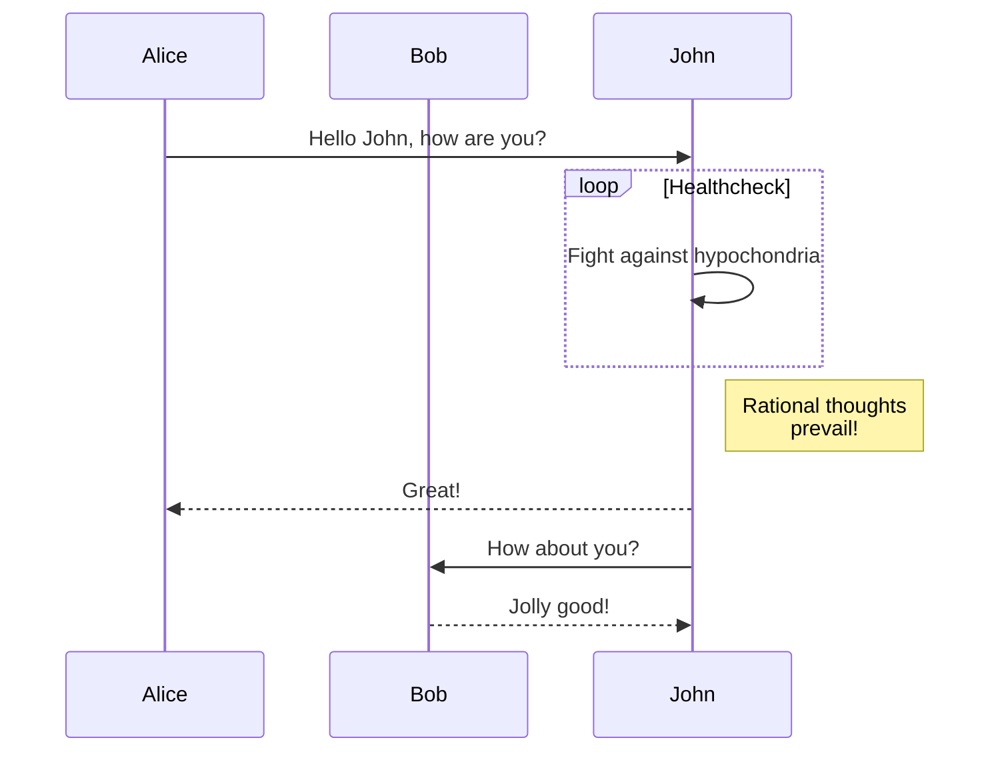
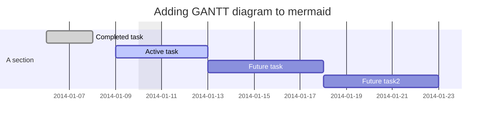
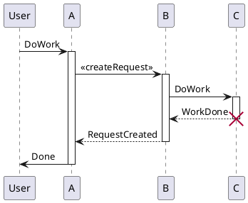

# ShowdownMDE Demo

ShowdownMDE is short for Showdown-MarkDown-Editor.

## Supporting some markdown extension features

[TOC]

### LaTeX math and AsciiMath

It's supported by [showdown-katex](https://github.com/obedm503/showdown-katex.git), that render [LaTeX](https://www.latex-project.org/) math and [AsciiMath](http://asciimath.org/) using [KaTeX](https://github.com/Khan/KaTeX), You can check [KaTeX supported functions/symbols](https://khan.github.io/KaTeX/function-support.html).

#### Math examples

```asciimath
x = (-b +- sqrt(b^2-4ac)) / (2a)
```

```latex
x=\frac{ -b\pm\sqrt{ b^2-4ac } } {2a}
```

### Table of Contents

It's implemented sub-TOC in showdown-toc.js.

[TOC]

#### TOC examples

```
  [TOC]
```

### Mermaid

It's implemented in showdown-mermaid.js, render diagrams of Flowchart or Sequence or Gantt using [mermaid](https://github.com/knsv/mermaid), check [mermaid doc](https://mermaidjs.github.io) for more information.

#### Mermaid examples:

##### Flowchart


##### Sequence diagram



##### Gantt diagram



### Plantuml

It's implemented in showdown-plantuml.js. render diagrams of uml using [plantuml](http://plantuml.com). To know more about PlantUML, please visit http://plantuml.com/.

#### Plantuml examples



### Footnotes

It's implemented in showdown-footnotes.js, use for reference the [showdown-footnotes](https://github.com/Kriegslustig/showdown-footnotes).

#### Footnotes examples

[^1]: The explanation.

## Showdown's Markdown syntax
